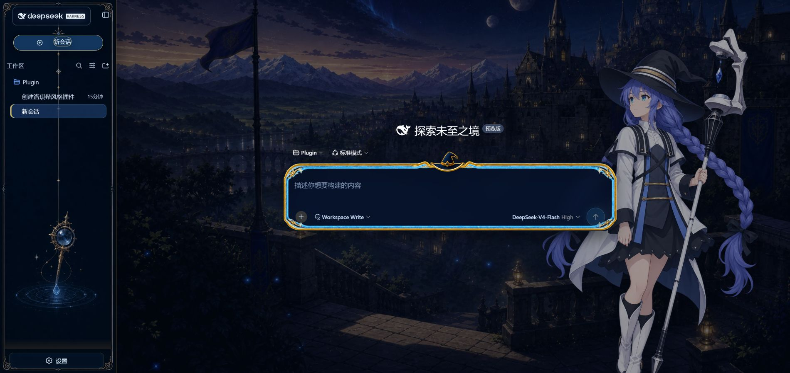

# Roxy Celestial Water-God Library

A self-contained, Roxy-inspired visual skin for DeepSeek Harness. The interface combines midnight navy surfaces, ice-blue starlight, antique-gold ornament, an isekai magic-academy dusk landscape, a decorative sidebar, and a character-led composer treatment.



## Highlights

- Faithful desktop treatment based on the approved visual direction.
- Character, background, sidebar, and composer artwork bundled as local WebP assets.
- No runtime CDN, remote font, or image dependency.
- Responsive character placement and reduced-motion support.
- Portable build configuration with no machine-specific absolute paths.
- Clean unload behavior: injected nodes, styles, observers, title, and theme color are restored.

## Requirements

- Node.js 22 or newer
- pnpm 10.15 or newer
- A local DeepSeek Harness installation

## Build

```bash
pnpm install
pnpm run check
```

## Install in DeepSeek Harness

From the repository root:

```bash
dsh plugin --profile web add "$PWD"
```

Restart the Harness web process, then refresh the browser. The included `cordis.patch.yml` registers the client plugin as `@dsh-external/dsh-client-ui-skin-roxy`.

## Repository layout

```text
assets/                 Bundled WebP artwork
src/client/             Browser skin runtime and CSS
src/index.ts            Host-side no-op entry
scripts/                Build maintenance scripts
.github/workflows/      GitHub Actions checks
cordis.patch.yml        Harness plugin registration
skin.json               Skin metadata and palette
tsdown.config.ts        Portable host/client bundler config
```

## Artwork notice

This is an unofficial fan-made theme. The bundled illustrations were generated for this project from the user-approved design direction and reference material; they are not official franchise assets. Personal and non-commercial use is recommended. Rights to *Mushoku Tensei* and Roxy Migurdia belong to their respective owners.

## Architecture acknowledgement

The composer phase handling and nine-slice frame strategy were informed by [Small-tailqwq/dsh-deep-whale](https://github.com/Small-tailqwq/dsh-deep-whale). This repository uses original Roxy-themed artwork and keeps the Harness-native controls intact.

## License

Code is released under the [MIT License](LICENSE). The artwork notice above applies separately to the bundled visual assets.
